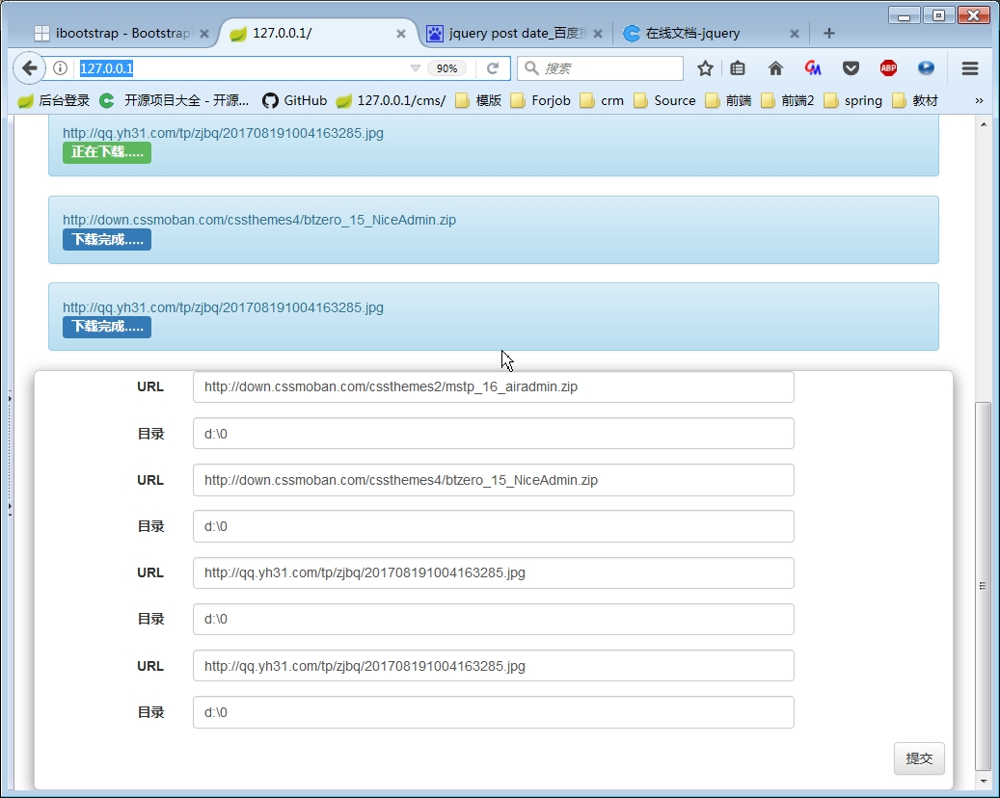
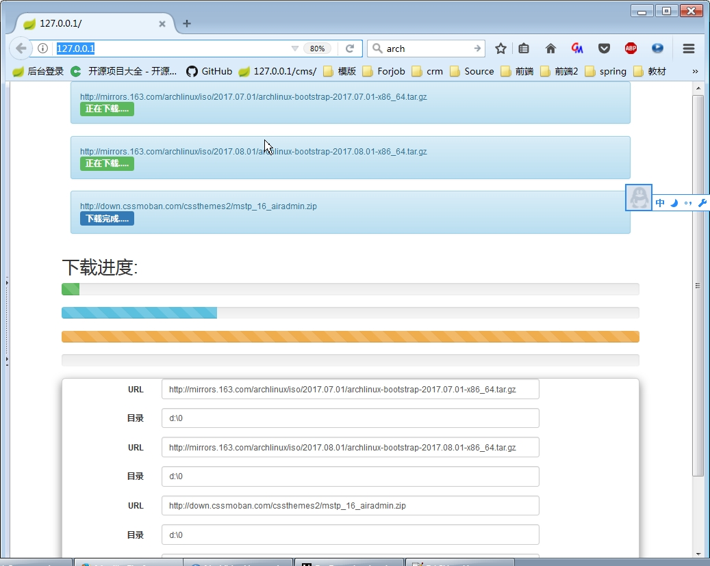

## 应用名称
ForDownloadproject

## 技术栈
	JDk8
	Spring
	JQuery
	Bootstrap3

## 功能介绍
后端实现: 多实例，多任务，断点续传，给前端返回各个下载任务进度
前端实现：异步post每个下载任务给后端，异步获取后端各个下载任务进度，响应后端各个下载任务，实时局部刷新页面

## 快速开始
* 本程序为maven项目，所有首先需要下载和配置好maven。http://maven.apache.org/download.cgi
* 返回本程序项目主页点击右上角按钮进行下载
* 解压项目
* 使用命令 mvn clean package构建项目
* 构建完成后一般在target\目录下会得到一个jar包，运行该jar包即可

## 应用截图

